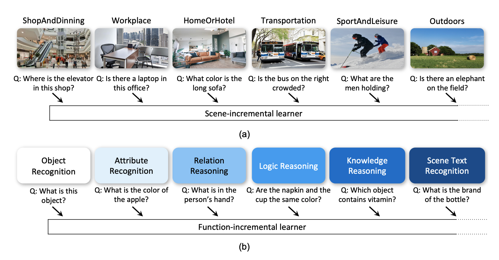

# CLVQA
# Symbolic Replay: Scene Graph as Prompt for Continual Learning on VQA Task (AAAI2023)

### [arXiv](https://arxiv.org/abs/2208.12037) | Data & annotation([json](https://github.com/showlab/CLVQA/releases/download/v1.0/CLOVE-json.zip)/[npy](https://github.com/showlab/CLVQA/releases/download/v1.0/CLOVE-npy.zip)) 



---

## Preparation
### Installation
```shell
conda create -n mmclvqa python=3.8
conda activate mmclvqa

git clone https://github.com/showlab/CLVQA.git
cd CLVQA
cd mmclvqa
pip install --editable .

cd ..
pip install extra_requirements.txt
```

### CLOVE Dataset and Annotation
We release the datasets and annotations in `json` format([link](https://github.com/showlab/CLVQA/releases/download/v1.0/CLOVE-json.zip)) and `npy` format([link](https://github.com/showlab/CLVQA/releases/download/v1.0/CLOVE-npy.zip)). To use our code for training, please download the `npy` files.

- Example of data sample:
    ```python
    { 
    'answer': 'kiosk',                                         # answer
    'answers': ['kiosk','kiosk',...],                          # answer in VQAv2 format, repeat 10 times if there is only one answer in the annotation
    'feature_path': '440.npy',                                 # feature path to retrieve features
    'gqa_question':                                            # GQA annotations, if applicable
                    { 'annotations': { 'answer': {},
                                        'fullAnswer': {},
                                        'question': {}},
                        'answer': 'kiosk',
                        'entailed': ['06778810', '06778808'],
                        'equivalent': ['06778808', '06778809'],
                        'fullAnswer': 'It is a kiosk.',
                        'groups': {'global': 'place', 'local': '02q-place'},
                        'imageId': '440',
                        'isBalanced': True,
                        'question': 'What place is this?',
                        'semantic': [ { 'argument': 'scene',
                                        'dependencies': [],
                                        'operation': 'select'},
                                    { 'argument': 'place',
                                        'dependencies': [0],
                                        'operation': 'query'}],
                        'semanticStr': 'select: scene->query: place [0]',
                        'types': { 'detailed': 'place',
                                'semantic': 'global',
                                'structural': 'query'}},
    'gt_scene_graph_mask': [1,0,0,0 ..., ],                  # Ground-truth SG mask for question answer generation corresponding to `gt_scene_graph_seq`. 1 represents the SG relation is related to the question-answer generation.           
    'gt_scene_graph_seq': [                                   # Ground-truth SG annotated for the image in this annotation datum.
        'kiosk [SEP]', 'counter [SEP]', 'lady [SEP]', 'trash can [SEP]', ...
        ],
    'image_id': '440',                                        # image id
    'image_source': 'vg',                                     # image source
    'ocr': [],                                                # ocr info in the image, applicable in textvqa
    'ocr_info': [],                                           # ocr info in the image, applicable in textvqa
    'ocr_tokens': [],                                         # ocr tokens, applicable in text vqa
    'pred_scene_graph_seq': [                                 # predicted SG extracted by an off-the-shelf model
                                'building behind man [SEP]',
                                'building behind woman [SEP]',
                                'man watching man [SEP]',
                                'person watching man [SEP]',
                                'building behind woman [SEP]',
                                ...
                            ],
    'program': [                                              # program excuted to generate question
                {'argument': 'scene', 'dependencies': [], 'operation': 'select'},
                { 'argument': 'place',
                    'dependencies': [0],
                    'operation': 'query'}
                ],
    'question': 'What place is this?',                        # question
    'question_id': 'g06778809',                               # question id
    'raw_question_type': {                                    # raw question type, applicable in original GQA annotation
                            'detailed': 'place',
                            'semantic': 'global',
                            'structural': 'query'
                            },
    'set_name': 'train',                                      # set name: train/val
    'stage': 'object',                                        # stage name for continual learning
    'supporting_fact': []                                     # supporting facts, applicable in stage "knowledge"
    }
    ```
---
## Training
### Symbolic Replay Model (SRM)
Implementation for Symbolic Replay Model could be found in [SRM/](SRM/). We provide training scripts for SRM [here](SRM/run/run_script.sh). Specifically,
```shell
cd SRM/
# training SRM under scene-incremental setting, with task order a->b->c->d->e->f, using distilgpt2
CUDA_VISIBLE_DEVICES=0 python train.py \
 --cl_setting scene \
 --task_seq abcdef \
 --model_name distilgpt2 \
 --model_dir_root  /...path_to/exp/clvqa/QAG_seq/not_use_gt/QAG_scene_task_token  \
 --add_task_tokens \
 --n_train_epochs 15

# training SRM under function-incremental setting, with task order o->a->r->l->k->s, using distilgpt2
CUDA_VISIBLE_DEVICES=0 python train.py \
--cl_setting functional \
--task_seq oarlks \
--model_name distilgpt2 \
--model_dir_root  /...path_to/exp/clvqa/QAG_seq/not_use_gt/QAG_functional_task_token  \ --add_task_tokens \
--n_train_epochs 15
```

-  We release our replayed samples for 6 task orders as reported in the paper.
    - [scene](https://github.com/showlab/CLVQA/releases/download/v1.0/secne_distilgpt2_replay.zip)
    - [function](https://github.com/showlab/CLVQA/releases/download/v1.0/function_distilgpt2_replay.zip)
- For the 6 tasks orders, you can inspect via these files: [scene](files/scene_perm.pkl) / [function](files/functional_perm.pkl) or refer to our paper.

### UniVQA
Refer to scripts in this [folder](run_scripts/mmclvqa) for one-stop training-and-testing (generated by [generate_run_scripts.py](generate_run_scripts.py)).
Specifically, training with replayed samples from SRM, with #replayed_samples : #current_task_samples = $1.5:1$, with task order $o \rightarrow a \rightarrow r \rightarrow l \rightarrow k \rightarrow s$:
```shell
ROOT=/Users/stan
DEVICE=0
if [ ! -f "$ROOT/exp/clvqa/save/functional/setting_1_oarlks/distilgpt2_replay_qag_seq_not_use_gt_task_token_1.5/unicl_attribute/unicl_final.pth" ] ; then 
 CUDA_VISIBLE_DEVICES=$DEVICE mmf_run config=EXP_CONFIG/functional/cl_attribute_unicl_standalone.yaml \
 model=unicl \
 dataset=clvqa \
 training.CL.use_cl=True \
 training.CL.use_callback=False \
 training.CL.use_replay=True \
 training.CL.replay_method=restore_with_prob \
 training.CL.task_order=oarlks \
 training.CL.restore_rate=1.5 \
 training.CL.restore_dir=$ROOT/exp/clvqa/QAG_seq/not_use_gt/QAG_functional_task_token/distilgpt2_replay/distilgpt2_functional_oarlks \
 training.CL.restore_paths=oarlks_REPLAY[o]_AT[a].npy \
 dataset_config.clvqa.use_mask_img=True \
 dataset_config.clvqa.mask_img_prob=0.15 \
 run_type=train_val \
 checkpoint.resume_file=$ROOT/exp/clvqa/save/stand_alone/functional/unicl_object/unicl_final.pth \
 env.save_dir=$ROOT/exp/clvqa/save/functional/setting_1_oarlks/distilgpt2_replay_qag_seq_not_use_gt_task_token_1.5/unicl_attribute \
 training.checkpoint_interval=4000 \
 training.callbacks=[] 
fi 


if [ ! -f "$ROOT/exp/clvqa/save/functional/setting_1_oarlks/distilgpt2_replay_qag_seq_not_use_gt_task_token_1.5/unicl_relation/unicl_final.pth" ] ; then 
 CUDA_VISIBLE_DEVICES=$DEVICE mmf_run config=EXP_CONFIG/functional/cl_relation_unicl_standalone.yaml \
 model=unicl \
 dataset=clvqa \
 training.CL.use_cl=True \
 training.CL.use_callback=False \
 training.CL.use_replay=True \
 training.CL.replay_method=restore_with_prob \
 training.CL.task_order=oarlks \
 training.CL.restore_rate=1.5 \
 training.CL.restore_dir=$ROOT/exp/clvqa/QAG_seq/not_use_gt/QAG_functional_task_token/distilgpt2_replay/distilgpt2_functional_oarlks \
 training.CL.restore_paths=oarlks_REPLAY[o]_AT[r].npy,oarlks_REPLAY[a]_AT[r].npy \
 dataset_config.clvqa.use_mask_img=True \
 dataset_config.clvqa.mask_img_prob=0.15 \
 run_type=train_val \
 checkpoint.resume_file=$ROOT/exp/clvqa/save/functional/setting_1_oarlks/distilgpt2_replay_qag_seq_not_use_gt_task_token_1.5/unicl_attribute/unicl_final.pth \
 env.save_dir=$ROOT/exp/clvqa/save/functional/setting_1_oarlks/distilgpt2_replay_qag_seq_not_use_gt_task_token_1.5/unicl_relation \
 training.checkpoint_interval=4000 \
 training.callbacks=[] 
fi 


if [ ! -f "$ROOT/exp/clvqa/save/functional/setting_1_oarlks/distilgpt2_replay_qag_seq_not_use_gt_task_token_1.5/unicl_logical/unicl_final.pth" ] ; then 
 CUDA_VISIBLE_DEVICES=$DEVICE mmf_run config=EXP_CONFIG/functional/cl_logical_unicl_standalone.yaml \
 model=unicl \
 dataset=clvqa \
 training.CL.use_cl=True \
 training.CL.use_callback=False \
 training.CL.use_replay=True \
 training.CL.replay_method=restore_with_prob \
 training.CL.task_order=oarlks \
 training.CL.restore_rate=1.5 \
 training.CL.restore_dir=$ROOT/exp/clvqa/QAG_seq/not_use_gt/QAG_functional_task_token/distilgpt2_replay/distilgpt2_functional_oarlks \
 training.CL.restore_paths=oarlks_REPLAY[o]_AT[l].npy,oarlks_REPLAY[a]_AT[l].npy,oarlks_REPLAY[r]_AT[l].npy \
 dataset_config.clvqa.use_mask_img=True \
 dataset_config.clvqa.mask_img_prob=0.15 \
 run_type=train_val \
 checkpoint.resume_file=$ROOT/exp/clvqa/save/functional/setting_1_oarlks/distilgpt2_replay_qag_seq_not_use_gt_task_token_1.5/unicl_relation/unicl_final.pth \
 env.save_dir=$ROOT/exp/clvqa/save/functional/setting_1_oarlks/distilgpt2_replay_qag_seq_not_use_gt_task_token_1.5/unicl_logical \
 training.checkpoint_interval=4000 \
 training.callbacks=[] 
fi 


if [ ! -f "$ROOT/exp/clvqa/save/functional/setting_1_oarlks/distilgpt2_replay_qag_seq_not_use_gt_task_token_1.5/unicl_knowledge/unicl_final.pth" ] ; then 
 CUDA_VISIBLE_DEVICES=$DEVICE mmf_run config=EXP_CONFIG/functional/cl_knowledge_unicl_standalone.yaml \
 model=unicl \
 dataset=clvqa \
 training.CL.use_cl=True \
 training.CL.use_callback=False \
 training.CL.use_replay=True \
 training.CL.replay_method=restore_with_prob \
 training.CL.task_order=oarlks \
 training.CL.restore_rate=1.5 \
 training.CL.restore_dir=$ROOT/exp/clvqa/QAG_seq/not_use_gt/QAG_functional_task_token/distilgpt2_replay/distilgpt2_functional_oarlks \
 training.CL.restore_paths=oarlks_REPLAY[o]_AT[k].npy,oarlks_REPLAY[a]_AT[k].npy,oarlks_REPLAY[r]_AT[k].npy,oarlks_REPLAY[l]_AT[k].npy \
 dataset_config.clvqa.use_mask_img=True \
 dataset_config.clvqa.mask_img_prob=0.15 \
 run_type=train_val \
 checkpoint.resume_file=$ROOT/exp/clvqa/save/functional/setting_1_oarlks/distilgpt2_replay_qag_seq_not_use_gt_task_token_1.5/unicl_logical/unicl_final.pth \
 env.save_dir=$ROOT/exp/clvqa/save/functional/setting_1_oarlks/distilgpt2_replay_qag_seq_not_use_gt_task_token_1.5/unicl_knowledge \
 training.checkpoint_interval=4000 \
 training.callbacks=[] 
fi 


if [ ! -f "$ROOT/exp/clvqa/save/functional/setting_1_oarlks/distilgpt2_replay_qag_seq_not_use_gt_task_token_1.5/unicl_scenetext/unicl_final.pth" ] ; then 
 CUDA_VISIBLE_DEVICES=$DEVICE mmf_run config=EXP_CONFIG/functional/cl_scenetext_unicl_standalone.yaml \
 model=unicl \
 dataset=clvqa \
 training.CL.use_cl=True \
 training.CL.use_callback=False \
 training.CL.use_replay=True \
 training.CL.replay_method=restore_with_prob \
 training.CL.task_order=oarlks \
 training.CL.restore_rate=1.5 \
 training.CL.restore_dir=$ROOT/exp/clvqa/QAG_seq/not_use_gt/QAG_functional_task_token/distilgpt2_replay/distilgpt2_functional_oarlks \
 training.CL.restore_paths=oarlks_REPLAY[o]_AT[s].npy,oarlks_REPLAY[a]_AT[s].npy,oarlks_REPLAY[r]_AT[s].npy,oarlks_REPLAY[l]_AT[s].npy,oarlks_REPLAY[k]_AT[s].npy \
 dataset_config.clvqa.use_mask_img=True \
 dataset_config.clvqa.mask_img_prob=0.15 \
 run_type=train_val \
 checkpoint.resume_file=$ROOT/exp/clvqa/save/functional/setting_1_oarlks/distilgpt2_replay_qag_seq_not_use_gt_task_token_1.5/unicl_knowledge/unicl_final.pth \
 env.save_dir=$ROOT/exp/clvqa/save/functional/setting_1_oarlks/distilgpt2_replay_qag_seq_not_use_gt_task_token_1.5/unicl_scenetext \
 training.checkpoint_interval=4000 \
 training.callbacks=[] 
fi 
```
- We config different settings and generate scripts in [generate_run_scripts.py](generate_run_scripts.py). Refer to this file for more settings you would like to explore.
- Implementation for Dataset pls refer to [dataset.py](mmclvqa/mmf/datasets/builders/clvqa/dataset.py).
- Implementation for UniVQA pls refer to [UniCL.py](mmclvqa/mmf/models/UniCL.py).
- [**LAST Checkpoint:Scene-SRM1.5xReplay-abcdef**](https://github.com/showlab/CLVQA/releases/download/v1.0/scene_abcdef_distilgpt2_replay_qag_seq_not_use_gt_task_token_1.5_unicl_final.pth) for scene setting, 1.5x SRM replayed samples, task order abcdef.
- [**LAST Checkpoint:Function-SRM1.5xReplay-oarlks**](https://github.com/showlab/CLVQA/releases/download/v1.0/function_oarlks_distilgpt2_replay_qag_seq_not_use_gt_task_token_1.5_unicl_final.pth) for function setting, 1.5x SRM replayed samples, task order oarlks.

---
## Testing
One can follow [generate_run_scripts.py](generate_run_scripts.py) to generate one stop training-and-testing. For testing only, please refer to [eval_os.py](eval_os.py). An testing example for function setting, 1.5x SRM replayed samples, task order oarlks.
```shell
python
>>> from eval_os import *
>>> stage_sweep(cl_setting='functional', setting_idx=1, abbr_seq='oarlks', device=0, model_name='unicl', save_dir='/Users/stan/exp/clvqa', val_exp='distilgpt2_replay_qag_seq_not_use_gt_task_token_1.5', test_stand_alone=False, test_reg=False, print_acc=False)
{'textvqa_accuracy': {'a2a': 0.4177,
                      'a2k': 0.1967,
                      'a2l': 0.0563,
                      'a2o': 0.4037,
                      'a2r': 0.121,
                      'a2s': 0.1453,
                      'k2a': 0.3263,
                      'k2k': 0.6813,
                      'k2l': 0.6807,
                      'k2o': 0.295,
                      'k2r': 0.3167,
                      'k2s': 0.1501,
                      'l2a': 0.272,
                      'l2k': 0.1943,
                      'l2l': 0.7153,
                      'l2o': 0.2653,
                      'l2r': 0.307,
                      'l2s': 0.1408,
                      'o2a': 0.1013,
                      'o2k': 0.1063,
                      'o2l': 0.0197,
                      'o2o': 0.5997,
                      'o2r': 0.0823,
                      'o2s': 0.0962,
                      'r2a': 0.3713,
                      'r2k': 0.2073,
                      'r2l': 0.121,
                      'r2o': 0.4023,
                      'r2r': 0.3943,
                      'r2s': 0.1555,
                      's2a': 0.3083,
                      's2k': 0.6253,
                      's2l': 0.6733,
                      's2o': 0.2963,
                      's2r': 0.3037,
                      's2s': 0.5511}}
{'textvqa_accuracy': [('o2o', 0.5997),
                      ('o2a', 0.1013),
                      ('o2r', 0.0823),
                      ('o2l', 0.0197),
                      ('o2k', 0.1063),
                      ('o2s', 0.0962),
                      ('a2o', 0.4037),
                      ('a2a', 0.4177),
                      ('a2r', 0.121),
                      ('a2l', 0.0563),
                      ('a2k', 0.1967),
                      ('a2s', 0.1453),
                      ('r2o', 0.4023),
                      ('r2a', 0.3713),
                      ('r2r', 0.3943),
                      ('r2l', 0.121),
                      ('r2k', 0.2073),
                      ('r2s', 0.1555),
                      ('l2o', 0.2653),
                      ('l2a', 0.272),
                      ('l2r', 0.307),
                      ('l2l', 0.7153),
                      ('l2k', 0.1943),
                      ('l2s', 0.1408),
                      ('k2o', 0.295),
                      ('k2a', 0.3263),
                      ('k2r', 0.3167),
                      ('k2l', 0.6807),
                      ('k2k', 0.6813),
                      ('k2s', 0.1501),
                      ('s2o', 0.2963),
                      ('s2a', 0.3083),
                      ('s2r', 0.3037),
                      ('s2l', 0.6733),
                      ('s2k', 0.6253),
                      ('s2s', 0.5511)]}
==> textvqa_accuracy | Final acc: [0.2963, 0.3083, 0.3037, 0.6733, 0.6253, 0.5511], weight avg acc: 0.45966666666666667. 
==> textvqa_accuracy | Backward transfer: [-0.3034, -0.1094, -0.09059999999999996, -0.04200000000000004, -0.05600000000000005], weighted bwt: -0.12028000000000004 
==> textvqa_accuracy | Forgetting: [0.41900000000000004, 0.40700000000000003, 0.4116, 0.04200000000000004, 0.09000000000000008], weighted forgetting: 0.27392.
```
---
## Misc
### config
- For each `.yaml` config file under [mmclvqa/EXP_CONFIG](mmclvqa/EXP_CONFIG), change the path of `annotations` to where you put your annotation files. E.g.,
    ```yaml
    annotations:
        train:
        - /your_path_to/fcl_mmf_attribute_train.npy
        val:
        - /your_path_to/fcl_mmf_attribute_val.npy
        test:
        - /your_path_to/fcl_mmf_attribute_val.npy
    ```

- For each `.yaml` config file under [mmclvqa/EXP_CONFIG](mmclvqa/EXP_CONFIG), change the path of `vocab_file` to where you put your vocab_files(use the copy under [files](files)). E.g.,
    ```yaml
    text_processor:
        type: bert_tokenizer
        params:
            max_length: 20 # change from 14 to 20
            vocab:
            type: intersected
            embedding_name: glove.6B.300d
            vocab_file: /your_path_to/vocabulary_100k.txt
    ###
    scene_graph_processor:
        type: scene_graph_bert_tokenizer
        params:
            max_length: 480
            vocab:
            type: intersected
            embedding_name: glove.6B.300d
            vocab_file: /your_path_to/vocabulary_100k.txt
    ###
    answer_processor:
        type: m4c_answer
        params:
            vocab_file: /your_path_to/clvqa_answer_6k.txt
    ```

- Modify paths in [mmclvqa/mmf/common/CL_constant.py](mmclvqa/mmf/common/CL_constant.py):
    ```python
    DATA_DIR = dict(        # modify path
        functional = "path to folder of function annotations",
        scene = "path to folder of scene annotations",
    )

    # These files are under files/
    GENERATED_SG_PTH = dict(
        functional = "/your_path_to/generated_sg_all_stages_v6.json", # modify path here
        scene = "/your_path_to/stage_sg_scene_setting_50u-50c.json",  # modify path here
    )
    ```
- For each `.yaml` config file under [mmclvqa/EXP_CONFIG](mmclvqa/EXP_CONFIG), you may change the `cache_dir` where the program would save the *automatically* downloaded features.
    ```yaml
    env:
        cache_dir: /workspace/stan/.cache/torch/mmf
    ```

- Path for SRM replayed samples. When training SRM, you may specify `--model_dir_root  [model_dir_root]`, the replayed samples will be saved under `[model_dir_root]/[model_name]_replay/[model_name]_[setting_name]_[task_order]/`(automatically set to be used at `training.CL.restore_dir` for UniVQA CL training).
- You may change the training batch size for UniVQA by passing `training.batch_size=xxx`.

---
## Cite Our Work
If you find our work helps, please cite our paper.
```bibtex
@article{lei2022symbolic,
  title={Symbolic replay: Scene graph as prompt for continual learning on vqa task},
  author={Lei, Stan Weixian and Gao, Difei and Wu, Jay Zhangjie and Wang, Yuxuan and Liu, Wei and Zhang, Mengmi and Shou, Mike Zheng},
  journal={arXiv preprint arXiv:2208.12037},
  year={2022}
}
```

---
## Contact
For any questions, welcome to create an issue or email Stan ([leiwx52@gmail.com](mailto:leiwx52@gmail.com)).

---
## Acknowledgement
- This codebase is based on [MMF](https://mmf.sh/) and [LAMOL](https://github.com/chho33/LAMOL) -- we thank the authors for their amazing works.
- We'd like to thank [Yujun Shi](https://yujun-shi.github.io/) for his valuable discussion.
